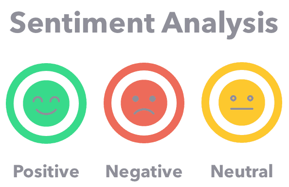

# Amazon reviews EDA and sentiment analysis

Datafiniti provides instant access to web data. We compile data from thousands of websites to create standardized databases of business, product, and property information. Datafiniti's amazon data is accessed from [kaggle]('https://www.kaggle.com/datafiniti/consumer-reviews-of-amazon-products)
In this project: Data preparation, data exploration, data cleansing, data modelling are focused.
